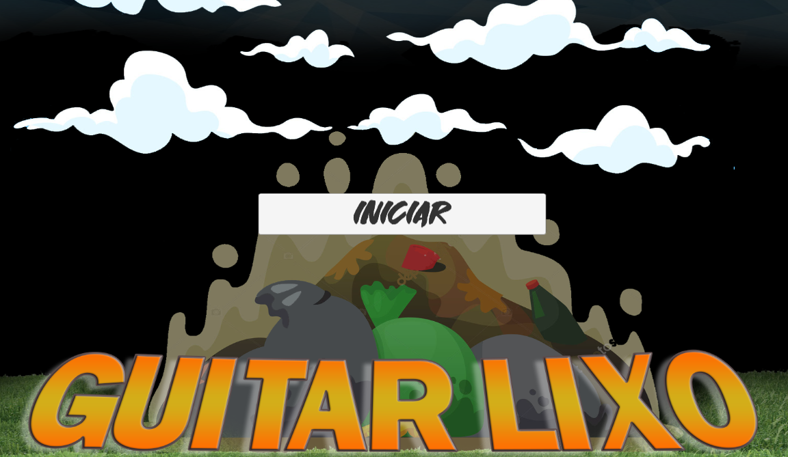
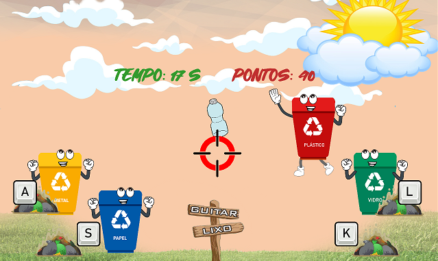

# Jogo-GuitarLixo
Por: [***Francisco Henrique***](https://www.linkedin.com/in/francisco-henrique-010912189)

### -Projeto desenvolvido utilizando á *Game Engine* [Unity](https://unity.com/) com C#.

## Objetivo
- Apresentar e Orientar como funciona o Guitar Lixo, Projeto 2D.

### Gameplay
- O jogo possui apenas uma fase, onde seu objetivo é coletar os lixos que caem no parque, porém cada lixo tem sua lixeira, ajude as lixeiras a pegarem seus respectivos tipos de lixo.

### Controles
* **A:** Movimenta a lixeira de Metal para pegar o lixo.
* **S:** Movimenta a lixeira de Papel para pegar o lixo.
* **K:** Movimenta a lixeira de Plástico para pegar o lixo.
* **L:** Movimenta a lixeira de Vidro para pegar o lixo.

## Para Executar:
* WEB: Na pasta Executável-WEB Rode o arquivo index.html e ele abrirá no seu navegador.
* PC: Na pasta Executável-PC rode o arquivo GuitarLixo.exe e ele abrirá em sua máquina.
